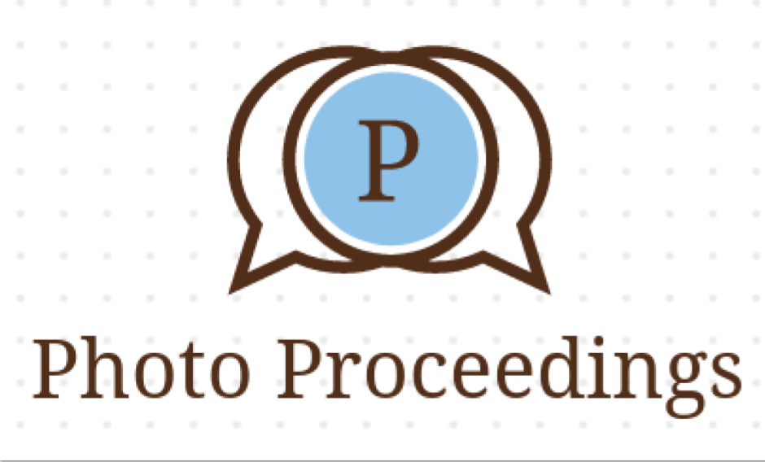

Para instalar este aplicativo es necesarios clonarlo desde git

Luego deberes tener apache y el modulo de postgres y php activado en este.

luego debes crear una base de datos con los nombres, usuairos y contrase;as que aparecen en el archivo .env

Cuando tengas todo esto debes crear un link simbolico ya que si usan php artisan serve no te dejara guardar la multimedia.

por ultimo modifica en php.ini lo siguiente
upload_max_filesize = 500M
post_max_size = 500M
php_value upload_max_filesize 500M
php_value post_max_size 500M

Luego de esto disfruta tu nuevo peque;o de instagram 

<!-- 

 -->

## About Photo Proceedings

It is a small development that invites internet users to upload photos and images for posterity.
Here you will not have censorship, you are free to upload what you want to share.
remember: the best thing we can do for another is not just share our photos with him, but show him new knowledge

This is a class exercise of University IUDigital in which I try to make an instagram clone.

Here you can register, update your personal information and upload your photos, you can see photos of others and you can comment and like

## Learning Photo proceedings

In this space there is the tutorial or the link to the tutorial or possibly a video

## Photo proceedings Sponsors

We would like to extend our thanks to the following sponsors for (me/DiegoMolina)development. If you are interested in becoming a sponsor, please visit  [Patreon page](https://github.com/diegomolinaquintero?tab=repositories).

<!-- ### Premium Partners

- **[Vehikl](https://vehikl.com/)**
- **[Tighten Co.](https://tighten.co)**
- **[Kirschbaum Development Group](https://kirschbaumdevelopment.com)**
- **[64 Robots](https://64robots.com)**
- **[Cubet Techno Labs](https://cubettech.com)**
- **[Cyber-Duck](https://cyber-duck.co.uk)**
- **[Many](https://www.many.co.uk)**
- **[Webdock, Fast VPS Hosting](https://www.webdock.io/en)**
- **[DevSquad](https://devsquad.com)**
- **[Curotec](https://www.curotec.com/services/technologies/laravel/)**
- **[OP.GG](https://op.gg)**
- **[CMS Max](https://www.cmsmax.com/)**
- **[WebReinvent](https://webreinvent.com/?utm_source=laravel&utm_medium=github&utm_campaign=patreon-sponsors)**
- **[Lendio](https://lendio.com)** -->

## Contributing

If you want to modify and improve it welcome, download, use it, modify it and upload it

## Code of Conduct

In order to ensure that the Laravel community is welcoming to all, please review and abide by the [Code of Conduct](https://laravel.com/docs/contributions#code-of-conduct).

## Security Vulnerabilities

<!-- If you discover a security vulnerability within Laravel, please send an e-mail to Taylor Otwell via [taylor@laravel.com](mailto:taylor@laravel.com). All security vulnerabilities will be promptly addressed. -->

## License

PhotoProceedins is open-sourced software licensed
 <!-- under the [MIT license](https://opensource.org/licenses/MIT). -->
